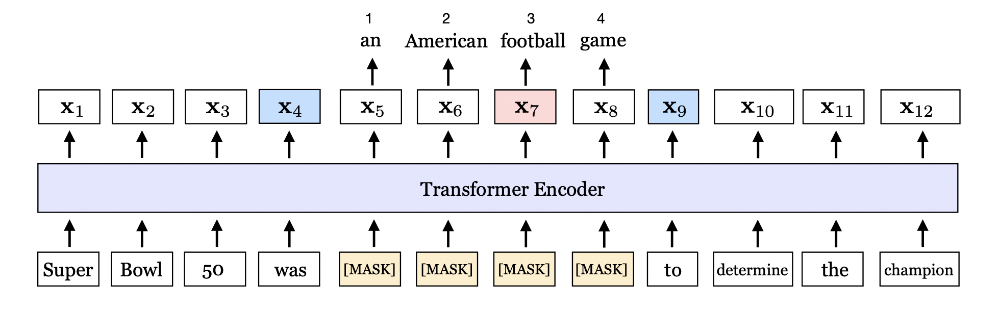
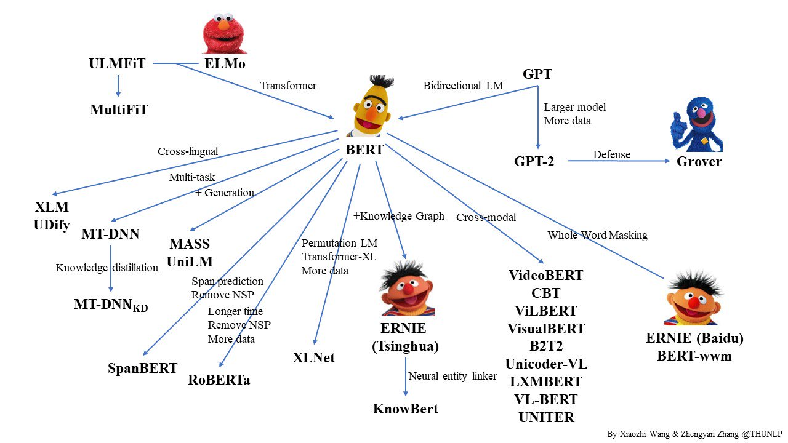

# SpanBERT : Improving Pre-training by Representing and Predicting Spans

## Keywords

`representation`; `transformer`; `BERT`; `span`; `boundary`; `SBO`; `NSP`;

## Representation 이란

- 👉참조링크
    
    [https://analyticsindiamag.com/a-comprehensive-guide-to-representation-learning-for-beginners/](https://analyticsindiamag.com/a-comprehensive-guide-to-representation-learning-for-beginners/)
    

    데이터를 통한 모델의 학습은 데이터의 크기가 학습의 완성도에 크게 기여한다.

    즉, 데이터의 크기가 클수록 학습이 더 효과적으로 이뤄진다.

    다만, 데이터의 크기가 클수록 다양한 feature 에 대응되는 pattern 을 찾기가 어려워진다.

    새로운 상황에도 대처할수 있는 pattern 을 찾아내는 학습을 representation learinig 이라 하고, 학습을 통해 얻어낸 통계적 pattern 을 representation 이라고 한다.

## Abstract & Intro

>🔥 **required ability** : reasoning about relationshps between two or more spans of text

    Q : Which NFL team won Super Bowl 50?
    A : Denver Broncos
 

위의 예시에서 (A) 와 같은 답을 내기 위해선, Denver Broncos 가 NFL team 의 일종이라는 것을 알아야 한다.

팀 이름 Denver Broncos 을 예측하는 데 있어서 ‘Denver’ 까지 예측하는 것(1단어)보다 ‘Denver Broncos’ 까지 예측(2단어, whole-size)하는 것이 더 어렵다.

즉, Denver 다음의 단어가 Broncos 임을 알더라도, 과연 Broncos 가 팀이름에 해당하는지의 문제 

    “어디까지가 팀의 이름인가?”

를 알아내기란 쉽지 않다. 

이러한 이유로 span 단위의 mask 를 사용하는 모델인 SpanBERT 를 소개한다.

SpanBERT 는 BERT 를 계승한 모델임.

- BERT vs SpanBERT
    - BERT :
        - word, subword 단위의 masking (MLM)
        - next sentence prediction : 2 half-sized segment (NSP)
    - SpanBERT
        - span$^1$ 단위의 masking (SBO)
        - single segment : sequence 단위로 입력
    - `MLM` vs. `SBO` , 2* `half-sized` vs. `single segment`

## Model

>**🔥 MLM+SBO+not using NSP(single sequence)**

BERT Objectives

- MLM Objective : masked sequence 로부터 올바른 sequence를 예측 (restore sentence)
    - 입력 sequence $Y$ 의 부분집합 $X\,(X \subset Y)$
    - 각각의 집합은 word 혹은 subword 토큰$(x_1,x_2,\cdots,x_n)$으로 이루어져 있음
    - $X$ 는 $Y$ 의 15%를 차지함
    - $X$의 토큰 중 80% 를 mask, 10%를 다른 토큰, 10% 는 그대로
- NSP Objective : 한 문장 뒤에 어떤 문장이 오는 지 예측 (cloze test)
    - $(A,B)$ 입력에서 $A$ 다음의 문장(segment) $B_{adjacent}$ 가 무엇인지 예측
    - $B_{adjacent}$ : $A$ 다음의 토큰 $[\mathtt{sep}]$ 이후의 segment  ($\mathtt{IsNext}$)
    - $B$ : 코퍼스에서 직접 찾은 문장(sequence) ($\mathtt{IsNext,NotNext}$) ($B_{adjacent}\subset B)$

다음과 같은 단점이 있음.

- MLM : 위의 예시처럼 context representaion 을 얻기에 부적합 (word, subword)
- NSP : 완전한 문장이 아님. 망가진 context (corrupted context) context representation 어려움

SpanBERT Objectives

- SBO(Span Boundary Objective) : span 단위 masked sequence
    - `span` : $(x_s,\cdots,x_e)$ `boundary` : $(x_{s-1},x_{e+1})$
    - 토큰의 단위는 subword 가 아닌 word. 즉, sequence 또한 완전한 단어들의 집합
    - `span.len` = $l$ 을 베르누이 분포 에 근거하여 선택
        - 그러나 $l$ 값이 어떤값으로 세팅되었는지 알 수가 없네..
        - $E(l)=3.8$ 으로만 제시되었을 뿐 어떤식으로 이득이 있는지 메커니즘을 알수가 없다..
    - `boundary` 토큰에 `span` 토큰 제외한 sequence 의 토큰들에 대한 representation 을 전달
        - 이케 하면, fine-tune 에서 쉽게 접근 가능 (representation 을 두개의 토큰에 몰아서)
        - $\mathrm{x_7}$을 예측하기 위해,  `boundary` representation $(\mathrm{x_4,x_9})$ 과 예측토큰의 `span` 상의 위치 $\mathrm{p_3}$ 가 주어진다.

$$
\mathcal{L}_{SBO}(\mathrm{football})=-\log P(\mathrm{football|x_4,x_9,p_3})
$$

- Single-Sequence Training
    - 그냥 `NSP` 자체를 안씀 (이것도 하나의 objective 라고 취급하는 거는 좀..)
        - full-length sentence 에서 얻는 이득이 더 크다
        - 코퍼스에서 다른 context, 즉 $B_{adjacent}$ 가 아닌 $B-B_{adjacent}$ 가 올 때, 잘못된 context 학습
    - 코퍼스를 최대 sequence 크기 $n=512$ 로 자른다. (segment 는 아예 안쓴다 이말!)
    
- `SBO` + `MLM` : 실제로는 cross entropy 계산시, `MLM` 도 사용
    - 아예 안쓴다는 말이 아니었음

$$
\begin{align*}
\mathcal{L}
&=\mathcal{L}_{MLM}(\mathrm{football})+\mathcal{L}_{SBO}(\mathrm{football})\\
&=-\log P(\mathrm{football|x_7})-\log P(\mathrm{football|x_4,x_9,p_3})
\end{align*}
$$

위 식은 간단하게 표현한 것이로 실제 모델에서는 다음이 일어난다.

## BERT 는 알차다

BERT 발표된 후, 다양한 버전의 -BERT 가 만들어짐

일종의 패러다임을 형성해서 진짜

        골수까지 쪽쪽 빨아먹을 정도로 자주 활용되었다.
     다음과 같은 이유로 많이 쓰이진 않았을까?

- 단순한 모델
    - GPT 나 다른 모델에 비해서 모델이 단순한
    - 것에 비해 우월한 성능을 자랑
    - 이걸 조금만 수정하면 ‘야나두' 마냥 성공 가능성
- 단순하기 때문에 개선될 여지
    - downstream task 에 fit 하는 작업이 없어서(undertrained)
    - 아마 다른 개발자들이 하이에나 마냥 달려들었을 거다
- 눈에 보이는 문제점
    - MLM : corrupted sentences
    - NSP : corrupted context